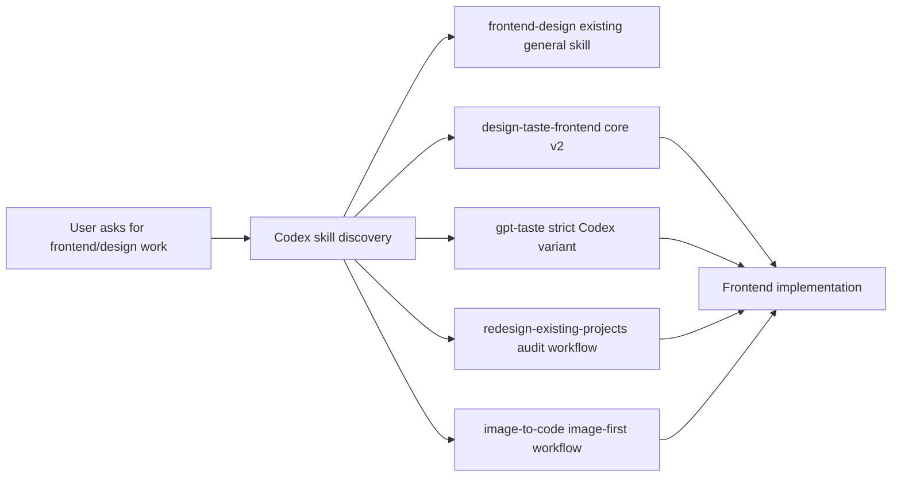

# SDD: Taste Skill design integration
Date: 2026-09-16
Status: approved

## 1. Context & Scope

- **Problem Statement:** Supergraph has one general `frontend-design` skill, while Taste Skill provides specialized design workflows for anti-slop frontend work, redesign audits, strict Codex output, and image-first implementation.
- **Goals:** Add four discoverable Codex skills from `leonxlnx/taste-skill`; preserve the existing `frontend-design` contract; validate each imported skill's frontmatter and source mapping.
- **Non-Goals:** Do not rewrite the existing skill, add runtime hooks, add dependencies, install global skills, or import image-generation-only skills (`imagegen-*`, `brandkit`).

## 2. Component & Flow Architecture

The imported files are instruction-only Markdown. No hook or executable runtime path is added.

## 3. Interface & Data Contracts

### 3.1 Skill registration contract

Each imported file MUST:

- live at `plugins/supergraph/skills/<skill-name>/SKILL.md`;
- start with YAML frontmatter delimiters;
- define exactly one `name:` and one `description:` field in frontmatter;
- use the following canonical names:

| Upstream path | Plugin path | Frontmatter name |
|---|---|---|
| `skills/taste-skill/SKILL.md` | `skills/design-taste-frontend/SKILL.md` | `design-taste-frontend` |
| `skills/gpt-tasteskill/SKILL.md` | `skills/gpt-taste/SKILL.md` | `gpt-taste` |
| `skills/redesign-skill/SKILL.md` | `skills/redesign-existing-projects/SKILL.md` | `redesign-existing-projects` |
| `skills/image-to-code-skill/SKILL.md` | `skills/image-to-code/SKILL.md` | `image-to-code` |

The source is fetched from the public upstream `main` tree on 2026-09-16 and pinned to commit `ccbc15639c97057cbfcf32ecebc38ef716e4bb37`. The plugin keeps the source content intact except for path renaming. The integration test locks the four SHA-256 values: `aa194351b246b8b4799099d4ed7b033d29eab6e6e3d58d8d2172978be7b3ec89`, `2e64c269953f2656c21bf5a0fa6b4568e82fe0c72b36e8f84758e090349966a5`, `98ad3e5b051bfb71b2795f7e8a6aa0d32b51ee095606c098a4b2822ac07926c9`, and `4c060a8064a8b13380bc2ef3d6e6a1d0b1e316aa093cd9807d0ce9e4eeb037fa` in table order.

### 3.2 Selection contract

- `design-taste-frontend` is the default anti-slop frontend direction.
- `gpt-taste` is opt-in for its stricter AIDA/GSAP/Codex constraints.
- `redesign-existing-projects` is opt-in for existing-project audits and targeted upgrades.
- `image-to-code` is opt-in when visual reference generation and analysis are part of the request.
- Existing `frontend-design` remains available and unchanged.

## 4. Platform Compatibility Matrix

| Capability | Codex | Claude Code | Antigravity | OpenCode |
|---|---|---|---|---|
| Skill files | Native plugin skill discovery | Shared Markdown-compatible instructions | Shared Markdown-compatible instructions | Shared Markdown-compatible instructions |
| Runtime hooks | None added | Existing hooks unchanged | Existing hooks unchanged | Existing plugin runtime unchanged |
| Image-first behavior | Available when image generation is available | Instruction-only fallback; no new tool contract | Instruction-only fallback; no new tool contract | Instruction-only fallback; no new tool contract |
| Existing workflow | Unchanged | Unchanged | Unchanged | Unchanged |

## 5. Failure Modes & Fallback Matrix

| Failure scenario | Trigger | Behavior | Recovery |
|---|---|---|---|
| Missing imported file | Upstream fetch/copy incomplete | Contract test fails | Re-fetch the exact upstream path |
| Invalid frontmatter | Missing delimiter/name/description or duplicate field | Skill integration test fails | Correct the imported file before use |
| Upstream unavailable | Network/DNS failure | Existing local skills remain usable | Retry fetch or use a pinned local source copy |
| Conflicting design directives | User asks for a different stack/style | Specialized skill is opt-in, not auto-forced | Follow user brief and existing project constraints |
| Image generation unavailable | `image-to-code` selected without image tool | Do not claim image-first evidence | Fall back to `design-taste-frontend` or ask for a reference |

## 6. Architecture Decision Records

### ADR-1: Add specialized skill namespaces instead of replacing `frontend-design`

- *Context:* The existing skill is already discoverable and may be referenced by users or docs.
- *Options Considered:* Replace/merge it; add upstream content under new canonical names; install globally outside the plugin.
- *Decision:* Add four new plugin-local skill directories and leave `frontend-design` unchanged.
- *Rationale & Trade-offs:* Preserves compatibility and makes specialized modes explicit; adds some overlapping guidance and requires users to choose the appropriate skill.

### ADR-2: Import coding/design workflows only

- *Context:* The upstream repository also contains image-generation and brandkit skills.
- *Options Considered:* Import every upstream folder; import the four README-recommended coding/design workflows; import only the core skill.
- *Decision:* Import core, strict Codex, redesign, and image-to-code workflows.
- *Rationale & Trade-offs:* Covers the highest-value frontend use cases without adding unrelated image-generation-only operational instructions or external dependencies.
