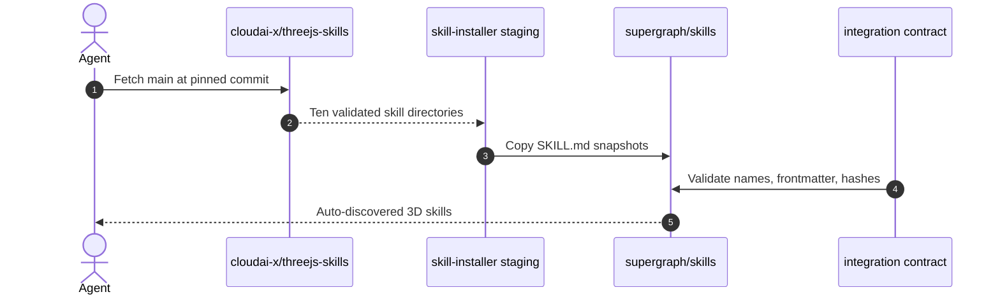

# SDD: Three.js 3D Skills Integration
Date: 2026-09-16
Status: approved

## 1. Context & Scope

- **Problem Statement:** The plugin has no curated Three.js guidance for 3D scene construction, assets, rendering effects, or interaction.
- **Goals:** Vendor the ten upstream `SKILL.md` files from `cloudai-x/threejs-skills` into the plugin's existing `skills/` discovery path; preserve upstream frontmatter/content; pin the snapshot by commit and SHA-256; add a regression contract test.
- **Non-Goals:** No runtime hook changes, MCP changes, npm dependencies, generated examples, or edits to the upstream source.

## 2. Component & Flow Architecture

## 3. Interface & Data Contracts

### 3.1 Skill discovery contract

The existing plugin manifest's `skills: "./skills/"` remains the only registration point. Each imported directory must contain exactly the upstream `SKILL.md` and use one of these names:

`threejs-animation`, `threejs-fundamentals`, `threejs-geometry`, `threejs-interaction`, `threejs-lighting`, `threejs-loaders`, `threejs-materials`, `threejs-postprocessing`, `threejs-shaders`, `threejs-textures`.

Every file must start with YAML frontmatter delimited by `---`, contain exactly one `name` and one `description`, and have `name` equal to its directory name.

### 3.2 Snapshot integrity contract

- Source repository: `https://github.com/cloudai-x/threejs-skills`
- Source ref: `main`
- Pinned commit: `b1c623076c661fc9b03dac19292e825a5d106823`
- Integrity: the contract test stores one SHA-256 per imported `SKILL.md`.
- Upstream updates require an intentional refresh of snapshots and expected hashes.

### 3.3 Data models & persistence

No runtime persistence. The vendored Markdown files are versioned plugin assets. No symlinks or wrapper README files are allowed in imported skill directories.

## 4. Platform Compatibility Matrix

| Feature | Claude Code | Antigravity | OpenCode | Codex |
|---|---|---|---|---|
| Skill source | `skills/threejs-*` | `skills/threejs-*` | Flat-linked by `install.sh` | Manifest `skills: "./skills/"` |
| Runtime dependency | None | None | None | None |
| Hook/MCP impact | None | None | None | None |
| Fallback | Skill remains optional | Skill remains optional | Existing link loop discovers it | Existing directory discovery |

## 5. Failure Modes & Fallback Matrix

| Failure Scenario | Trigger Condition | System Behavior | Fallback / Recovery |
|---|---|---|---|
| Upstream fetch fails | GitHub/network unavailable | Do not mutate plugin | Retry with approved network access; keep current plugin |
| Snapshot drift | Hash differs | Contract test fails | Review upstream diff, update intentionally |
| Invalid frontmatter | Missing/duplicate field | Contract test fails | Repair/re-fetch before integration |
| Unsupported file | Symlink or extra wrapper appears | Contract test fails | Remove unsupported asset; preserve only skill snapshot |
| Skill not discovered | Wrong directory or manifest path | Platform smoke test fails | Restore `skills/` layout; do not change runtime hooks |

## 6. Architecture Decision Records (ADRs)

- **ADR-1: Vendor all ten upstream skills under the existing discovery root**
  - *Context:* The plugin already exposes a shared `skills/` directory across supported platforms.
  - *Options Considered:* Add a runtime downloader; vendor a curated subset; vendor all ten snapshots.
  - *Decision:* Vendor all ten `SKILL.md` snapshots.
  - *Rationale & Trade-offs:* Deterministic/offline discovery and no runtime dependency; updates require deliberate snapshot refresh.

- **ADR-2: Pin content with commit and SHA-256 contract checks**
  - *Context:* `main` is mutable and upstream content is external input.
  - *Options Considered:* Track branch only; use git submodule; store commit plus file hashes.
  - *Decision:* Store the commit in this SDD and enforce file hashes in a shell contract test.
  - *Rationale & Trade-offs:* Works with the existing asset-only plugin and makes drift visible; hash maintenance is required for upgrades.
