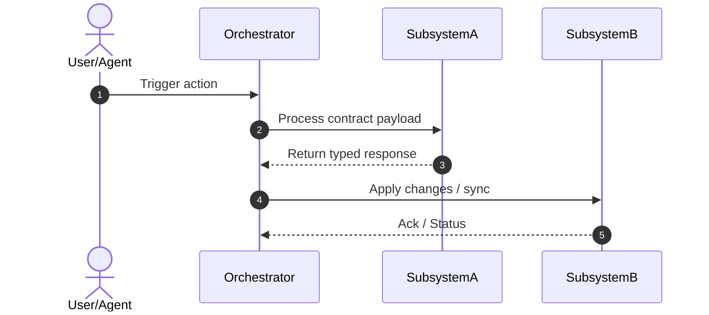

# /supergraph:sdd

Draft a machine-readable Software Design Document (SDD) with Mermaid architecture diagrams, strict data/interface contracts, and platform compatibility matrices before task decomposition in `/supergraph:plan`.

Announce: "📐 /supergraph:sdd — drafting Software Design Document..."

## Quick Gate
- **Micro Tier** (<20 lines, ≤2 files, no schema/API/hook changes) → skip directly to `/supergraph:tdd`.
- **Standard Tier** (≤5 files, clear local change, no cross-boundary) → optional; draft mini-spec if touching API/data contracts.
- **Full Tier** (>5 files, architectural change, API/schema modification, multi-platform runtime) → **MANDATORY**.

---

## Steps

### 1. Load Context & Architecture

**1a. Read Domain Vocabulary:**
```bash
head -60 CONTEXT.md 2>/dev/null || echo "No CONTEXT.md"
```
Always reuse terms from `CONTEXT.md` for entities, roles, and components.

**1b. Read PRD (if exists):**
Check latest PRD in `docs/supergraph/plans/*prd*.md`:
```bash
ls -t docs/supergraph/plans/*prd*.md 2>/dev/null | head -1
```

**1c. Codebase Architecture Overview:**
Query `codebase-memory-mcp` (`get_architecture` with `overview`, `layers`, `boundaries`) or inspect hub nodes with Serena. Identify affected components and cross-module boundaries.

---

### 2. Draft Software Design Document (SDD)

Generate the document using the following structured template:

```markdown
# SDD: [Feature / System Name]
Date: YYYY-MM-DD
Status: draft | approved

## 1. Context & Scope
- **Problem Statement:** [What technical gap or requirement does this address?]
- **Goals:** [Specific technical capabilities to enable]
- **Non-Goals:** [What this design explicitly does NOT cover]

## 2. Component & Flow Architecture



## 3. Interface & Data Contracts

### 3.1 Input / Output Schemas
[Define exact JSON schemas, TypeScript interfaces, Protobuf, or CLI stdin/stdout contracts]

```json
{
  "$schema": "http://json-schema.org/draft-07/schema#",
  "type": "object",
  "required": ["status", "data"],
  "properties": {
    "status": { "type": "string", "enum": ["ok", "error"] },
    "data": { "type": "object" }
  }
}
```

### 3.2 Data Models & Persistence
- Entity definitions, table schema migrations, or state files.
- Invariants & validation rules.

## 4. Platform Compatibility Matrix
*(Mandatory for multi-platform tools, hooks, and CLI integrations)*

| Feature / Hook | Claude Code | Antigravity | OpenCode | Codex |
|---|---|---|---|---|
| Lifecycle Event | `SessionStart` | `PreInvocation` (turn 1) | `session.idle` | `SessionStart` |
| Output Protocol | Terminal stdout | `injectSteps` (ephemeral) | `chat.message` | `hookSpecificOutput` |
| Fallback | Silent exit 0 | Fallback `allow` | No-op | Exit 0 |

## 5. Failure Modes & Fallback Matrix

| Failure Scenario | Trigger Condition | System Behavior | Fallback / Recovery |
|---|---|---|---|
| Timeout / Hang | Tool/command > 30s | Abort execution | Return error JSON, notify caller |
| Contract Mismatch | Payload missing field | Reject with validation error | Log diagnostic warning |
| Missing Dependency | CLI/MCP not available | Soft degrade | Skip feature non-blockingly |

## 6. Architecture Decision Records (ADRs)
- **ADR-1: [Decision Title]**
  - *Context:* [Why was this decision needed?]
  - *Options Considered:* [Option A vs Option B]
  - *Decision:* [Chosen approach]
  - *Rationale & Trade-offs:* [Why it won and what trade-offs were accepted]
```

---

### 3. Save SDD File

Save the design document to:
```bash
mkdir -p docs/supergraph/sdd
# Path: docs/supergraph/sdd/YYYY-MM-DD-sdd-<slug>.md
```

---

### 4. Present for Approval (MANDATORY GATE)

Present a summary of the SDD to the user in their language:
- Key architectural flows
- Critical interface contracts & schemas
- Platform compatibility trade-offs

Ask: **"Does this design meet your technical requirements? [yes / adjust / reject]"**

Incorporate any feedback before proceeding.

---

### 5. Handoff to Planning

Once approved (`Review: Approved`):
- Hand off to `/supergraph:plan`.
- In `/supergraph:plan`, every TDD task and contract test must strictly reference the schemas and flows defined in this SDD.
